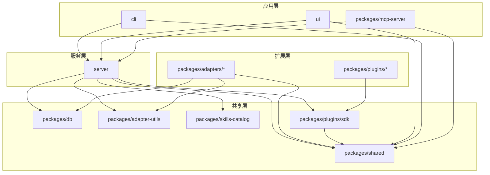

# 架构全景

## 项目概述

**它是什么**：Paperclip 是一个开源的 AI Agent 编排系统，以 Node.js 服务器 + React UI 的形式提供，让用户像管理公司一样管理 AI 代理团队。

**为什么存在**：当用户同时运行多个 AI 代理（Claude Code、OpenClaw、Codex、Cursor 等）时，面临代理协调困难、目标对齐缺失、成本失控、工作不可审计等问题。Paperclip 将代理管理转化为"公司管理"视角——用组织架构、目标分解、审批流程、预算控制来治理 AI 代理团队。

**核心设计理念**：
- **If OpenClaw is an employee, Paperclip is the company** —— 代理是员工，Paperclip 是公司运营系统
- **Manage business goals, not pull requests** —— 管理业务目标而非代码提交
- **Bring your own agents** —— 通过适配器接入任何 AI 运行时，不绑定单一供应商
- **If it can receive a heartbeat, it's hired** —— 任何能响应心跳的代理都可以被雇佣

---

## 模块拆解

### server（后端服务）

**它是什么**：基于 Express.js 的 REST API 服务器，承载所有业务逻辑、数据持久化、实时通信和插件运行时。

**为什么存在**：作为系统的"中枢神经系统"，负责代理注册、任务分发、心跳调度、审批流转、成本追踪、插件生命周期管理等核心编排能力。

**主要文件**：
- `server/src/index.ts` —— 服务器启动入口，初始化数据库、配置、插件管理器、实时 WebSocket
- `server/src/app.ts` —— Express 应用组装，注册所有路由和中间件
- `server/src/config.ts` —— 配置加载（数据库模式、部署模式、认证、存储等）
- `server/src/services/` —— 核心业务服务层，包含 agents、heartbeat、issues、approvals、goals、budgets、routines、plugins 等 80+ 个服务模块
- `server/src/routes/` —— REST API 路由层，对外暴露 companies、agents、issues、goals、approvals、plugins、adapters 等端点
- `server/src/middleware/` —— 认证、日志、错误处理、主机名守卫等中间件
- `server/src/storage/` —— 存储抽象（S3 / 本地磁盘）
- `server/src/secrets/` —— 密钥管理抽象（AWS Secrets Manager / 本地加密）
- `server/src/realtime/` —— WebSocket 实时事件推送

---

### ui（前端界面）

**它是什么**：基于 React + Vite 的单页应用，提供 Dashboard 式的代理团队管理界面。

**为什么存在**：让用户以"任务管理器"的直观体验管理代理团队，支持从手机访问，提供目标追踪、Issue 看板、审批操作、成本监控等可视化能力。

**主要文件**：
- `ui/src/main.tsx` —— 应用入口
- `ui/src/App.tsx` —— 根组件与路由
- `ui/src/pages/` —— 页面级组件（Dashboard、Agents、Issues、Goals、Approvals、Costs、CompanySettings 等）
- `ui/src/components/` —— 可复用 UI 组件
- `ui/src/hooks/` —— 前端状态与副作用钩子
- `ui/src/api/` —— 后端 API 调用封装

---

### cli（命令行工具）

**它是什么**：基于 Commander.js 的 CLI，包名为 `paperclipai`，用于安装配置、诊断、触发代理执行、管理资源。

**为什么存在**：提供自动化入口和运维能力，支持开发者快速启动实例、运行心跳、管理公司/代理/目标/Issue、备份数据库等无需打开浏览器的操作。

**主要文件**：
- `cli/src/index.ts` —— CLI 入口，注册所有子命令
- `cli/src/commands/onboard.ts` —— 交互式首次安装向导
- `cli/src/commands/heartbeat-run.ts` —— 触发代理心跳执行
- `cli/src/commands/run.ts` —— 运行代理任务
- `cli/src/commands/client/` —— 各资源管理命令（company、agent、issue、goal、approval 等）

---

### packages/db（数据库层）

**它是什么**：基于 Drizzle ORM + PostgreSQL 的数据库封装，提供 schema 定义、迁移、嵌入式 Postgres 支持。

**为什么存在**：统一数据访问层，支持自托管场景下的嵌入式 Postgres（无需外部数据库），同时支持标准 Postgres 部署。

**主要文件**：
- `packages/db/src/index.ts` —— 导出客户端、迁移工具、备份恢复
- `packages/db/src/schema/` —— 数十张表定义（agents、issues、goals、approvals、companies、cost_events、budget_policies 等）
- `packages/db/src/client.ts` —— 数据库连接与查询客户端

---

### packages/shared（共享常量与类型）

**它是什么**：跨包共享的常量、枚举、类型定义和工具函数。

**为什么存在**：避免 server/ui/cli/packages 之间重复定义业务枚举和类型，保证前后端语义一致。

**主要文件**：
- `packages/shared/src/index.ts` —— 导出所有共享定义（AGENT_STATUSES、ISSUE_STATUSES、GOAL_STATUSES、APPROVAL_TYPES、BUDGET_METRICS 等）

---

### packages/adapters（适配器体系）

**它是什么**：连接外部 AI Agent 运行时的适配器集合，每个适配器将一个具体的 AI 工具接入 Paperclip 的编排体系。

**为什么存在**：Paperclip 的核心设计是"Bring your own agents"，通过适配器解耦与具体 AI 供应商的绑定，让用户可以自由组合 Claude、Codex、Cursor、OpenClaw、Grok、Gemini 等。

**主要适配器**：
- `adapters/claude-local` —— Claude Code 本地适配器
- `adapters/codex-local` —— OpenAI Codex 本地适配器
- `adapters/cursor-local` / `cursor-cloud` —— Cursor 本地/云端适配器
- `adapters/openclaw-gateway` —— OpenClaw 网关适配器
- `adapters/grok-local` —— Grok 本地适配器
- `adapters/gemini-local` —— Gemini 本地适配器
- `adapters/opencode-local` —— OpenCode 本地适配器
- `adapters/acpx-local` —— ACPX 本地适配器
- `adapters/pi-local` —— Pi 本地适配器

---

### packages/adapter-utils（适配器工具）

**它是什么**：适配器开发共享的类型定义、会话压缩策略、日志脱敏等工具。

**为什么存在**：提取适配器公共逻辑，降低新适配器的开发成本，统一会话管理和安全策略。

**主要文件**：
- `packages/adapter-utils/src/types.ts` —— 适配器统一接口（AdapterAgent、AdapterRuntime、AdapterSkill 等）
- `packages/adapter-utils/src/session-compaction.ts` —— 会话压缩策略
- `packages/adapter-utils/src/log-redaction.ts` —— 日志脱敏工具

---

### packages/plugins（插件体系）

**它是什么**：基于 JSON-RPC over stdio 的插件扩展系统，允许第三方通过插件扩展 Paperclip 的能力。

**为什么存在**：核心系统无法覆盖所有业务场景（如自定义沙箱、外部 Wiki 同步、文件差异分析），插件机制让社区和内部团队可以安全地扩展功能，同时保持核心稳定。

**主要子模块**：
- `plugins/sdk` —— 插件开发 SDK（definePlugin、worker RPC、UI 组件、事件订阅、任务调度）
- `plugins/create-paperclip-plugin` —— 插件脚手架工具
- `plugins/plugin-llm-wiki` —— LLM Wiki 知识库插件
- `plugins/plugin-workspace-diff` —— 工作区差异分析插件
- `plugins/paperclip-plugin-fake-sandbox` —— 测试用假沙箱插件
- `plugins/examples/` —— 官方示例插件（hello-world、file-browser、kitchen-sink 等）
- `plugins/sandbox-providers/` —— 沙箱提供商插件（Cloudflare、Daytona、E2B、Modal、ExeDev）

---

### packages/mcp-server（MCP 服务器）

**它是什么**：将 Paperclip 的能力以 Model Context Protocol (MCP) 形式暴露给外部 AI 工具。

**为什么存在**：MCP 是 AI 工具互操作的新兴标准，通过 MCP 服务器，外部 AI（如 Claude Desktop）可以直接调用 Paperclip 的 API 管理代理和 Issue。

**主要文件**：
- `packages/mcp-server/src/index.ts` —— MCP 服务器入口，基于 `@modelcontextprotocol/sdk`
- `packages/mcp-server/src/tools.ts` —— 工具定义（将 Paperclip API 映射为 MCP tools）
- `packages/mcp-server/src/client.ts` —— Paperclip API 客户端

---

### packages/skills-catalog（技能目录）

**它是什么**：预定义 Agent 技能的静态目录包，以 JSON 形式提供技能清单。

**为什么存在**：统一管理和分发可复用的 Agent 技能模板，让不同适配器可以共享同一套技能定义。

**主要文件**：
- `packages/skills-catalog/src/index.ts` —— 导出 catalog 清单和查询函数
- `packages/skills-catalog/catalog/` —— 技能定义目录
- `packages/skills-catalog/generated/catalog.json` —— 生成的技能清单

---

## 模块依赖关系

---

## 核心抽象

| 抽象 | 说明 | 所在位置 |
|------|------|----------|
| **Agent** | 被管理的 AI 代理实体，有状态、角色、适配器类型 | `packages/db/src/schema/agents.ts` |
| **Issue** | 代理要执行的具体工作任务，支持层级分解 | `packages/db/src/schema/issues.ts` |
| **Goal** | 高层业务目标，可分解为多个 Issue | `packages/db/src/schema/goals.ts` |
| **Approval** | 人工或自动审批节点，控制代理执行权限 | `packages/db/src/schema/approvals.ts` |
| **Heartbeat** | 代理心跳机制，用于唤醒和调度代理执行任务 | `server/src/services/heartbeat.ts` |
| **Routine** | 定时/周期性任务编排 | `server/src/services/routines.ts` |
| **Adapter** | 外部 AI 运行时的统一接口 | `packages/adapter-utils/src/types.ts` |
| **Plugin** | 基于 JSON-RPC 的扩展模块 | `packages/plugins/sdk/src/types.ts` |
| **Environment** | 代理执行环境（沙箱/本地） | `server/src/services/environments.ts` |
| **Budget** | 成本预算与告警 | `server/src/services/budgets.ts` |

---

## 扩展机制

### 适配器扩展

**它是什么**：通过实现 `AdapterRuntime` 和 `AdapterAgent` 接口，将新的 AI 工具接入 Paperclip。

**为什么这么设计**：
- AI 生态碎片化严重，每个供应商有自己的协议和调用方式
- 适配器模式将"如何调用 AI"与"如何管理 AI"解耦
- 新适配器只需关注会话管理和命令执行，无需理解 Paperclip 的业务逻辑

### 插件扩展

**它是什么**：基于 JSON-RPC over stdio 的进程外扩展，插件作为独立进程运行，通过 SDK 与宿主通信。

**为什么这么设计**：
- **安全隔离**：插件崩溃不影响核心系统
- **语言无关**：插件可以用任何能输出 JSON-RPC 的语言编写
- **能力边界清晰**：通过 Capability 机制控制插件权限
- **热更新支持**：插件可以独立开发、独立部署、独立版本管理

### 技能目录扩展

**它是什么**：通过向 `packages/skills-catalog/catalog/` 添加技能定义，所有适配器可共享新技能。

**为什么这么设计**：
- 技能是代理的"岗位说明书"，需要统一标准
- 静态 JSON 目录便于版本控制和分发
- 与适配器解耦，同一技能可被多个适配器复用
