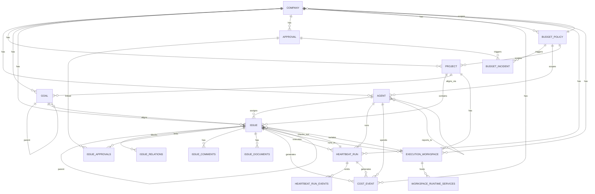

# 数据流与状态管理

## 核心数据结构

每个核心数据结构按以下结构说明：

### Company（公司）

**它是什么**：Company 是 Paperclip 系统的顶层租户隔离单元，代表一个“AI 公司”。所有 Agent、Project、Issue、Goal 等资源都归属到一个 Company 下。

**为什么这样建模**：Paperclip 采用多租户架构，Company 作为根级命名空间，确保不同客户的数据完全隔离。同时，Company 承载了全局预算控制（`budgetMonthlyCents`、`spentMonthlyCents`）和 Issue 编号前缀（`issuePrefix`）等租户级配置。

**字段说明**：
- `issuePrefix` / `issueCounter`：用于生成人类可读的 Issue 标识符（如 PAP-39），避免纯 UUID 不友好的问题。
- `budgetMonthlyCents` / `spentMonthlyCents`：公司级月度预算硬上限，与 `budgetPolicies` 表联动。
- `requireBoardApprovalForNewAgents`：是否要求董事会审批才能创建新 Agent，体现治理控制。
- `status` / `pauseReason` / `pausedAt`：公司级暂停机制，预算超支或手动暂停时冻结整个公司运行。

---

### Agent（代理）

**它是什么**：Agent 是 Paperclip 中执行具体任务的 AI 实体，对应一个外部 AI 运行时（Claude Code、Codex、Cursor 等）的接入配置。

**为什么这样建模**：将每个外部 AI 运行时抽象为“公司员工”，通过 `adapterType` + `adapterConfig` 屏蔽底层差异，统一用心跳机制调度。`reportsTo` 字段构建组织架构，实现层级汇报和权限继承。

**字段说明**：
- `status`：idle / running / paused / pending_approval / terminated。状态机控制 Agent 是否能被唤醒。
- `adapterType` / `adapterConfig` / `runtimeConfig`：适配器配置和运行时配置分离，前者连接外部系统，后者控制 Paperclip 内部行为（如心跳间隔、最大并发运行数）。
- `permissions`：JSONB 存储的权限对象，目前核心权限是 `canCreateAgents`。CEO 角色默认拥有此权限。
- `budgetMonthlyCents` / `spentMonthlyCents`：Agent 级预算控制，与公司级预算共同构成多级预算体系。
- `defaultEnvironmentId`：Agent 默认执行环境，创建 Issue 时会自动继承到 `executionWorkspaceSettings`。
- `lastHeartbeatAt`：最后一次心跳时间，用于判断 Agent 是否在线。

---

### Goal（目标）

**它是什么**：Goal 是公司战略目标的层级分解结构，支持从公司级到任务级的多级嵌套。

**为什么这样建模**：AI Agent 团队需要目标对齐机制。Goal 的树形结构（`parentId`）让高层战略可以逐层分解为可执行的具体目标，Project 通过 `project_goals` 关联表与 Goal 对齐。

**字段说明**：
- `level`：company / team / agent / task，表示目标的层级。
- `status`：planned / active / achieved / cancelled，目标生命周期状态。
- `parentId`：自引用外键，构建目标树。
- `ownerAgentId`：目标负责人 Agent。

---

### Issue（任务）

**它是什么**：Issue 是 Paperclip 中最核心的工作单元，代表一个需要完成的具体任务。它是 Agent 执行的直接载体。

**为什么这样建模**：Issue 融合了项目管理（状态、优先级、指派）、代码执行（checkoutRunId、executionRunId、executionWorkspaceId）和审批流（executionPolicy、executionState）三种模型。通过 `parentId` 和 `issueRelations` 实现树形结构和依赖关系，支持复杂的工作分解和阻塞管理。

**字段说明**：
- `status`：backlog / todo / in_progress / in_review / done / blocked / cancelled。这是 Issue 的核心状态机。
- `workMode`：standard / planning，区分执行模式和规划模式。
- `assigneeAgentId` / `assigneeUserId`：Issue 只能有一个指派对象（Agent 或人类用户）。
- `checkoutRunId` / `executionRunId`：当前检出（checkout）的运行 ID 和实际执行运行的 ID。checkout 表示 Agent 已认领该 Issue，execution 表示正在执行。
- `executionLockedAt`：执行锁时间戳，防止并发冲突。
- `parentId`：自引用外键，构建 Issue 父子树。子 Issue 继承父 Issue 的 projectId 和 goalId。
- `goalId` / `projectId`：Issue 对齐的目标和项目。
- `originKind` / `originId` / `originFingerprint`：Issue 的来源追踪。支持 manual、routine_execution、harness_liveness_escalation 等多种来源，用于自动化场景和去重。
- `executionPolicy` / `executionState`：JSONB 存储的执行策略和当前执行状态。支持多阶段审批（review / approval）和参与者分配。
- `monitorNextCheckAt` / `monitorAttemptCount`：Issue 监控机制，用于外部服务检查和自动恢复。
- `executionWorkspaceId` / `executionWorkspacePreference` / `executionWorkspaceSettings`：执行工作区配置，隔离不同 Issue 的运行环境。
- `hiddenAt`：软删除标记，Issue 不真正删除而是隐藏。

---

### IssueRelations（任务关系）

**它是什么**：IssueRelations 是 Issue 之间的显式关系表，目前主要用于表达“阻塞（blocks）”关系。

**为什么这样建模**：将关系独立成表而非在 Issue 表中用数组存储，是为了支持双向查询（谁阻塞了我 / 我阻塞了谁），同时避免 JSONB 查询性能问题。`issueId` 是阻塞者，`relatedIssueId` 是被阻塞者。

**字段说明**：
- `type`：目前仅支持 "blocks"，为未来扩展（如 depends_on、relates_to）预留。
- `companyEdgeUq`：唯一索引防止重复关系。

---

### Approval（审批）

**它是什么**：Approval 是 Paperclip 中的通用审批记录，用于 Agent 雇佣、预算超支、CEO 策略等需要人类董事会介入的场景。

**为什么这样建模**：审批与业务对象解耦，通过 `issue_approvals` 关联表可以链接到具体 Issue。这种设计让同一个审批可以关联多个 Issue，同时 Issue 也可以有多个审批。

**字段说明**：
- `type`：hire_agent / approve_ceo_strategy / budget_override_required / request_board_approval。
- `status`：pending / revision_requested / approved / rejected / cancelled。
- `payload`：JSONB 存储审批的上下文数据（如 Agent 配置、预算金额）。
- `requestedByAgentId` / `requestedByUserId`：审批请求者，支持 Agent 发起自批或人类发起。
- `decidedByUserId` / `decidedAt` / `decisionNote`：审批决策记录。

---

### HeartbeatRun（心跳执行）

**它是什么**：HeartbeatRun 记录 Agent 每一次心跳唤醒后的执行实例，是 Agent 实际工作的运行时载体。

**为什么这样建模**：心跳机制是 Paperclip 调度 Agent 的核心。每次唤醒产生一个 HeartbeatRun，记录从队列到运行再到完成的完整生命周期。通过 `contextSnapshot` 保存执行上下文（如关联的 Issue ID），实现执行状态的可恢复性。

**字段说明**：
- `status`：queued / scheduled_retry / running / succeeded / failed / cancelled / timed_out。
- `invocationSource`：timer / assignment / on_demand / automation，表示唤醒来源。
- `contextSnapshot`：JSONB 存储的上下文快照，包含 `issueId`、`taskId`、`wakeReason` 等，是执行恢复的关键。
- `retryOfRunId` / `scheduledRetryAt` / `scheduledRetryAttempt`：重试机制，支持失败后定时重试。
- `livenessState` / `livenessReason`：运行存活状态，用于检测僵死运行。
- `logStore` / `logRef` / `logBytes` / `logSha256` / `logCompressed`：运行日志的存储元数据。
- `sessionIdBefore` / `sessionIdAfter`：Agent 会话 ID 追踪，支持会话重置和恢复。

---

### ExecutionWorkspace（执行工作区）

**它是什么**：ExecutionWorkspace 是 Issue 执行时的隔离工作环境，通常对应一个 Git 分支或本地目录。

**为什么这样建模**：不同 Issue 可能在同一代码库上并行执行，需要物理隔离。ExecutionWorkspace 通过 `mode`（shared_workspace / isolated_workspace 等）和 `providerType`（local_fs / git 等）提供灵活的隔离策略。

**字段说明**：
- `mode` / `strategyType`：工作区模式（共享/隔离）和策略类型。
- `sourceIssueId`：工作区由哪个 Issue 创建。
- `derivedFromExecutionWorkspaceId`：支持从现有工作区派生，减少重复克隆。
- `status`：active / closed，工作区生命周期。
- `cleanupEligibleAt` / `cleanupReason`：工作区清理策略，资源回收。

---

### CostEvent（成本事件）

**它是什么**：CostEvent 记录每一次 AI 调用的成本明细，包括输入/输出 token 数、费用、模型、提供商等。

**为什么这样建模**：精细化的成本追踪是多 Agent 系统的刚需。CostEvent 与 Agent、Issue、Project、Goal、HeartbeatRun 多表关联，支持从任意维度聚合成本。

**字段说明**：
- `costCents`：费用（美分），统一货币单位。
- `inputTokens` / `cachedInputTokens` / `outputTokens`：Token 使用量，用于分析模型效率。
- `provider` / `biller` / `billingType` / `model`：计费维度，支持按提供商、计费类型（metered_api / subscription_included 等）、模型聚合。
- `billingCode`：自定义计费码，支持内部成本分摊。
- `occurredAt`：事件发生时间，用于时间窗口聚合。

---

### BudgetPolicy / BudgetIncident（预算策略与事件）

**它是什么**：BudgetPolicy 定义了公司/Agent/项目三级预算规则，BudgetIncident 记录预算告警和硬停事件。

**为什么这样建模**：将预算规则与成本事件分离，规则可以独立配置和修改，事件作为历史记录不可篡改。支持 soft（警告）和 hard（暂停）两种阈值类型。

**字段说明**：
- `scopeType` / `scopeId`：预算作用域（company / agent / project）。
- `metric`：目前仅支持 billed_cents，为未来扩展（如 token 数、请求数）预留。
- `windowKind`：calendar_month_utc / lifetime，时间窗口类型。
- `warnPercent` / `hardStopEnabled`：软警告阈值和硬停开关。
- `amount`：预算上限（美分）。
- BudgetIncident 的 `thresholdType`：soft / hard，区分告警和暂停事件。

---

## 数据生命周期

**它从哪里来**：
- **用户输入**：通过 UI 或 API 创建 Company、Agent、Project、Goal、Issue、Approval 等。
- **Agent 执行**：Agent 心跳运行时产生 HeartbeatRun、CostEvent、IssueComment、IssueExecutionDecision 等。
- **系统自动**：定时任务产生 RoutineRun、预算检查产生 BudgetIncident、存活监控产生 IssueRecoveryAction。
- **外部集成**：适配器（Claude、Codex 等）通过 API 上报执行结果和成本。

**经历什么转换**：
1. **创建阶段**：用户/Agent 创建 Issue，系统分配唯一标识符（`issuePrefix-counter`），继承父 Issue 或项目的 projectId/goalId，自动设置执行工作区。
2. **分配阶段**：Issue 被指派给 Agent（assigneeAgentId），Agent 通过心跳唤醒执行。
3. **检出阶段**：Agent 调用 `checkout` API，设置 `checkoutRunId=executionRunId=heartbeatRunId`，状态变为 in_progress。
4. **执行阶段**：Agent 在 ExecutionWorkspace 中工作，产生 CostEvent、IssueComment、IssueExecutionDecision。
5. **审批阶段**：如果 Issue 的 executionPolicy 包含 approval 阶段，会创建 Approval 记录，等待董事会决策。
6. **完成阶段**：Agent 将 Issue 标记为 done 或 cancelled，系统清理执行锁，触发父 Issue 的完成检查。
7. **监控阶段**：系统通过 monitor 字段监控 Issue 状态，异常时创建 RecoveryAction 或 LivenessEscalation Issue。

**到哪里去**：
- **持久化**：所有数据最终写入 PostgreSQL，通过 Drizzle ORM 操作。
- **返回给用户**：通过 REST API 返回给 UI，前端使用 React Query 缓存和订阅。
- **传递给下游**：Issue 完成可能触发父 Issue 的自动完成检查、预算事件触发 Agent/Project 暂停、审批结果触发 Agent 激活或终止。

---

## 状态管理

**它是什么**：
Paperclip 维护以下核心状态：
- **Issue 状态**：backlog → todo → in_progress → in_review → done / blocked / cancelled
- **Agent 状态**：idle / running / paused / pending_approval / terminated
- **HeartbeatRun 状态**：queued → running → succeeded / failed / cancelled / timed_out
- **Approval 状态**：pending → revision_requested → approved / rejected
- **BudgetIncident 状态**：open → resolved / dismissed
- **ExecutionWorkspace 状态**：active → closed

**为什么这样管理**：
- **数据库作为单一事实来源**：所有状态变更通过数据库事务保证原子性，没有独立的内存状态机。
- **乐观锁与执行锁**：Issue 的 `checkoutRunId` + `executionLockedAt` 实现悲观锁，防止多 Agent 并发执行同一 Issue。
- **前端缓存策略**：UI 使用 React Query（TanStack Query）的 `queryClient` 进行乐观更新和缓存失效。`LiveUpdatesProvider` 通过 WebSocket 接收实时事件，精确失效相关查询键。
- **无全局 Redux/MobX**：前端状态分散在 React Context（CompanyContext、ToastContext 等）和 React Query 缓存中，避免全局状态树的复杂度。

---

## 并发与一致性

**数据库事务隔离**：
- 所有核心写操作（Issue checkout、update、Approval resolve）使用 PostgreSQL 事务。
- `syncBlockedByIssueIds` 显式使用 `SELECT ... FOR UPDATE` 锁定相关 Issue 行，防止并发修改阻塞关系导致循环。
- `adoptStaleCheckoutRun` 和 `adoptUnownedCheckoutRun` 通过原子 UPDATE 条件（`checkoutRunId = expected`）实现无锁竞争的安全接管。

**执行锁机制**：
- Issue 进入 `in_progress` 时设置 `checkoutRunId` 和 `executionRunId`。
- Agent 每次操作前调用 `assertCheckoutOwner`，验证当前运行是否仍持有锁。
- 运行终止（terminal status）后，`clearExecutionRunIfTerminal` 自动清理锁。

**预算并发控制**：
- `costService.createEvent` 在事务中先插入 CostEvent，再重新计算月度总花费并更新 Agent/Company 的 `spentMonthlyCents`。
- `budgetService.evaluateCostEvent` 检查预算阈值，可能触发 BudgetIncident 创建和 Agent/Project 暂停，全部在同一事务链中完成。

**前端并发**：
- `LiveUpdatesProvider` 使用 WebSocket 接收服务器推送事件，通过 `queryClient.invalidateQueries` 触发缓存刷新。
- 对于当前可见 Issue 的评论，前端采用乐观更新（`hydrateVisibleIssueComment`）直接插入缓存，避免闪烁。
- Toast 通知使用门控机制（`ToastGate`），防止重连风暴导致消息轰炸。

---

## 核心实体关系图（ER 图）

---

## 关键设计决策

1. **Issue 标识符使用前缀+计数器而非纯 UUID**：`issuePrefix`（如 PAP）+ `issueCounter` 生成人类可读的标识符（PAP-39），便于 Agent 和人类在沟通中引用。计数器通过 `GREATEST(counter, MAX(issue_number)) + 1` 自校正，防止并发冲突。

2. **Issue 的 `parentId` 与 `issueRelations` 分离**：`parentId` 表达父子分解关系（一棵树），`issueRelations` 表达显式阻塞关系（有向图）。这种分离让树形结构简单高效，同时支持复杂的依赖网络。

3. **Agent 权限使用 JSONB 而非独立权限表**：`permissions` 字段存储 `{ canCreateAgents: boolean }`，通过 `normalizeAgentPermissions` 函数与角色（role）联动。CEO 默认拥有所有权限，其他 Agent 可显式授予。这种设计避免了复杂的 RBAC 表结构，同时保留了扩展性。

4. **HeartbeatRun 的 `contextSnapshot` 作为执行上下文**：每次唤醒时，系统将 Issue ID、唤醒原因、交互 ID 等信息写入 `contextSnapshot`。这使得运行日志、成本事件、审批流都能追溯到具体的业务上下文，同时支持运行中断后的恢复。

5. **预算控制三级模型**：Company / Agent / Project 三级预算策略，通过 `budgetPolicies` 表统一配置，`costEvents` 触发实时评估。硬停（hard stop）直接修改 Agent/Project/Company 的 `status` 为 paused，从源头阻止新执行。

6. **前端实时更新通过 WebSocket + 精确缓存失效**：`LiveUpdatesProvider` 订阅 `/api/companies/{id}/events/ws`，根据事件类型（heartbeat.run.status / activity.logged / agent.status 等）精确失效 React Query 的查询键。对于当前可见 Issue，采用乐观更新策略避免 UI 闪烁。
