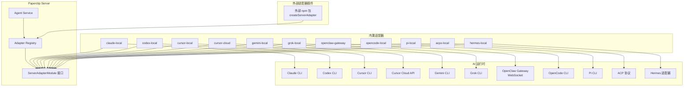

# 依赖与生态

## 核心依赖

### Express

**它是什么**：Express 是 Node.js 生态中最成熟的轻量级 Web 框架，提供路由、中间件、请求/响应处理等基础能力。

**为什么选择它**：Paperclip 选择 Express 5.x 而非 Fastify 或 NestJS，核心原因是"足够简单、足够成熟"。项目不需要 Fastify 的高性能路由（ Paperclip 的瓶颈在 AI 调用而非 HTTP 吞吐量），也不需要 NestJS 的重量级 IOC 容器和装饰器体系。Express 的中间件模型与项目所需的认证、日志、错误处理、请求体解析等能力完全匹配，且团队和社区对其行为有充分预期。此外，Express 5 原生支持异步错误处理，减少了样板代码。

**项目中的角色**：作为整个服务器的 HTTP 层骨架，承载所有 REST API 路由、静态资源服务、Vite 开发模式中间件集成、以及 Better Auth 的认证端点挂载。

---

### Drizzle ORM

**它是什么**：Drizzle ORM 是一个类型安全的 TypeScript ORM，采用 SQL-like 的查询 API 设计，支持 PostgreSQL、MySQL、SQLite 等数据库。

**为什么选择它**：项目明确没有选择 Prisma（迁移和客户端生成流程过重，对 monorepo 不够友好）或 TypeORM（装饰器驱动模型与项目风格不符，运行时反射带来额外复杂度）。Drizzle 的优势在于：
- 纯 TypeScript 编写，无需代码生成步骤；
- 查询语法接近 SQL，开发者可以直观理解生成的查询；
- 与 Zod 类型系统天然兼容；
- 轻量，对启动时间和内存占用影响小；
- 支持嵌入式 PostgreSQL（embedded-postgres），方便本地开发和测试。

**项目中的角色**：定义所有数据库表结构（`packages/db/src/schema/`）、执行查询和迁移、在插件系统中为每个插件提供隔离的数据库命名空间（`plugin_database_namespaces`）。Better Auth 也通过 Drizzle Adapter 接入同一套数据库。

---

### Better Auth

**它是什么**：Better Auth 是一个现代化的 TypeScript 认证库，提供会话管理、OAuth、多因素认证等能力，以"框架无关"和"类型安全"为设计目标。

**为什么选择它**：项目没有选择 Passport.js（配置繁琐、中间件模型老旧）或 NextAuth（与 Next.js 强耦合，而 Paperclip 使用纯 React + Vite）。Better Auth 的优势在于：
- 原生支持 Drizzle ORM，通过 `drizzleAdapter` 直接复用项目的数据库 schema；
- 提供基于 cookie 的会话管理，支持多实例部署时的 cookie 前缀隔离（`deriveAuthCookiePrefix`）；
- 内置邮箱密码认证，且支持关闭注册（`disableSignUp`）；
- 与 Express 的集成简单，通过 `toNodeHandler` 即可挂载。

**项目中的角色**：处理所有用户认证流程（登录、注册、会话验证），为 board 用户和 agent 提供 JWT 之外的会话认证路径。在 `server/src/auth/better-auth.ts` 中封装了实例化逻辑，并根据部署模式自动决定是否禁用安全 cookie。

---

### Zod

**它是什么**：Zod 是一个 TypeScript 优先的模式验证库，提供运行时类型检查和静态类型推断。

**为什么选择它**：相比 Joi、Yup、class-validator 等替代品，Zod 的优势在于：
- 与 TypeScript 类型系统完全同构，一个 schema 同时提供运行时验证和静态类型；
- 无装饰器依赖，不依赖 `reflect-metadata`；
- 被插件 SDK 直接 re-export，插件作者无需额外安装依赖即可使用；
- 生态丰富，与 Drizzle、Better Auth、MCP SDK 等核心依赖都有良好集成。

**项目中的角色**：
- 请求体验证（`server/src/middleware/validate.ts`）；
- 插件 manifest 和配置校验；
- MCP Server 的工具参数 schema 定义；
- 共享类型定义（`@paperclipai/shared`）中的输入输出约束。

---

### React + Vite

**它是什么**：React 19 是用于构建用户界面的声明式库；Vite 是下一代前端构建工具，以原生 ESM 和极速 HMR 著称。

**为什么选择它**：React 是团队最熟悉的前端框架，且项目需要与大量 AI 相关的流式 UI（`@assistant-ui/react`、Markdown 渲染、Mermaid 图表）集成，React 生态最为丰富。选择 Vite 而非 Next.js 或 Webpack 的原因是：
- Paperclip 的 UI 是一个"Dashboard"应用，不需要 SSR/SSG；
- Vite 的 HMR 速度对插件 UI 开发至关重要；
- 项目通过 `middlewareMode` 将 Vite 开发服务器嵌入 Express，实现前后端一体化开发体验；
- 生产构建输出纯静态文件，由 Express 直接托管，部署简单。

**项目中的角色**：React 负责所有前端界面（Issue 看板、Goal 管理、Agent 配置、插件 UI 插槽渲染）；Vite 负责开发服务器、生产构建、以及插件 UI bundle 的构建流程。

---

### Pino

**它是什么**：Pino 是一个高性能的 Node.js 日志库，以低开销和结构化日志输出为特点。

**为什么选择它**：相比 Winston、Bunyan，Pino 的日志序列化开销最低，且原生支持 JSON 结构化输出，便于后续日志收集和分析。`pino-pretty` 提供开发时的可读格式，`pino-http` 自动记录 HTTP 请求日志。

**项目中的角色**：作为整个服务器的统一日志基础设施，被中间件、服务层、插件 worker 日志代理等广泛使用。

---

### WebSocket (ws)

**它是什么**：`ws` 是 Node.js 生态中最流行的 WebSocket 库，提供客户端和服务端的 WebSocket 实现。

**为什么选择它**：项目需要与 OpenClaw Gateway 进行实时双向通信（非简单的 SSE），`ws` 提供了稳定、低延迟的 WebSocket 连接能力，且无需引入 Socket.io 等更重的抽象层。

**项目中的角色**：在 `openclaw-gateway` 适配器中作为客户端与远程 Gateway 建立 WebSocket 连接；在服务器端也用于实时事件推送（live-events-ws）。

---

### AJV

**它是什么**：AJV（Another JSON Schema Validator）是性能最优的 JSON Schema 验证器。

**为什么选择它**：虽然 Zod 已经覆盖了大部分验证场景，但 AJV 用于处理插件 manifest 中的 `instanceConfigSchema`（JSON Schema 格式）以及外部配置的校验，因为 JSON Schema 是跨语言的标准，更适合插件生态的互操作性。

**项目中的角色**：插件 manifest 校验、外部 JSON Schema 验证。

---

## 有意不使用的方案

### 为什么不用 Fastify / NestJS

项目明确选择了 Express 而非 Fastify 或 NestJS。Fastify 的性能优势在 Paperclip 的场景下不构成决定性因素（AI 代理调用的延迟远高于 HTTP 框架的差异），而其插件生态和中间件模型与 Express 不兼容，会增加学习成本。NestJS 的 IOC 容器、装饰器驱动开发和模块系统对于 Paperclip 这种"扁平化服务层"架构来说过于沉重，会引入不必要的抽象层和启动开销。

### 为什么不用 Prisma / TypeORM

Prisma 的 schema 定义和客户端生成流程与 monorepo 结构配合不佳，且其查询引擎的二进制依赖会增加部署复杂度。TypeORM 的装饰器驱动模型与项目"纯接口+函数"的风格不符，且其活跃的维护状态和 API 稳定性存在历史问题。Drizzle 的 SQL-like API 让开发者能直观理解生成的查询，且完全基于 TypeScript 类型，无需额外构建步骤。

### 为什么不用 Passport.js / NextAuth

Passport.js 的中间件模型与 Express 5 的异步错误处理配合不够优雅，且策略配置繁琐。NextAuth 与 Next.js 框架强耦合，而 Paperclip 使用 Vite + React 的纯客户端方案，NextAuth 的诸多假设（如文件系统路由、API Routes）不适用。Better Auth 提供了更现代的 API 设计，且与 Drizzle 的集成是原生支持的。

### 为什么不用 Socket.io

Socket.io 提供了房间、广播、自动重连等高级功能，但 Paperclip 的实时通信需求相对简单：OpenClaw Gateway 需要稳定的 WebSocket 连接，服务器端需要 SSE 推送。引入 Socket.io 会增加客户端库依赖和协议复杂度，而原生 `ws` + SSE 已足够覆盖所有场景。

---

## 外部系统集成

**集成点在哪里**：

1. **AI 代理运行时**：通过适配器体系连接 Claude Code、OpenClaw、Codex、Cursor、Grok、Gemini、OpenCode、Pi 等外部 AI 系统。每个适配器负责将 Paperclip 的通用执行上下文转换为特定 AI 工具的 CLI 调用或 API 调用。
2. **PostgreSQL 数据库**：通过 Drizzle ORM 和 `postgres` 驱动连接，存储所有业务数据（Issue、Goal、Agent、Approval 等）以及插件状态。
3. **AWS S3**：通过 `@aws-sdk/client-s3` 实现文件存储（资产上传、备份等），通过 `StorageService` 抽象接口注入。
4. **OpenClaw Gateway**：通过 WebSocket 协议与远程 Gateway 通信，使用自定义的 JSON-RPC 风格协议（`GatewayWsClient`），支持设备认证（Ed25519）和自动配对。
5. **MCP 协议**：通过 `@modelcontextprotocol/sdk` 实现 MCP Server，将 Paperclip 的 Issue、Agent、Project 等核心能力以 Tool 的形式暴露给外部 MCP Client（如 Claude Desktop）。
6. **LLM 提供商**：通过各适配器间接调用 Anthropic、OpenAI、Google、xAI 等 LLM API，部分通过本地 CLI 工具（如 `claude`、`codex`）调用。

**为什么这样划分边界**：

- **适配器层**将"如何调用 AI 工具"的细节隔离在独立的 npm 包中，服务器核心无需关心 Claude CLI 的参数格式或 OpenClaw 的 WebSocket 协议；
- **数据库层**通过 Drizzle 的 schema 定义和迁移系统，确保所有数据访问都经过类型检查；
- **存储层**通过 `StorageService` 接口抽象，允许在本地文件系统和 S3 之间切换；
- **插件层**通过 JSON-RPC over stdio 的进程隔离，确保第三方代码的故障不会影响主机稳定性；
- **MCP 层**作为独立进程（`paperclip-mcp-server`），通过 stdio 与 MCP Host 通信，将 Paperclip 的能力以标准化协议暴露出去。

---

## 项目定位

**在同类工具中的位置**：

Paperclip 的核心定位是"AI Agent 编排系统"，与以下类别工具形成差异：

- **vs 单一 AI 工具（如 Claude Code、Cursor）**：Paperclip 不替代这些工具，而是作为"管理层"协调多个工具协同工作，解决多代理之间的任务分配、状态同步、成本追踪问题；
- **vs 通用工作流引擎（如 n8n、Temporal）**：Paperclip 专门为 AI 代理设计，内置了 Issue 生命周期、审批流程、心跳机制、预算控制等 AI 特有的治理概念；
- **vs 多代理框架（如 AutoGen、CrewAI）**：Paperclip 不是库，而是完整的应用（服务器 + UI + CLI），提供开箱即用的看板、审批、成本监控等企业级功能；
- **vs 云端 AI 平台（如 OpenClaw、Devin）**：Paperclip 是开源、自托管的，数据完全由用户控制，同时通过适配器兼容云端和本地代理。

**核心优势**：
- **多运行时兼容**：通过适配器体系同时支持 10+ 种 AI 代理运行时；
- **企业治理**：内置审批、预算、权限、审计等企业级功能；
- **可扩展性**：插件系统允许第三方扩展几乎任何功能（工具、事件、任务、UI、环境驱动）；
- **开放协议**：通过 MCP 协议与外部 AI 生态互通。

**有意不支持的功能**：

1. **内置 LLM 推理**：Paperclip 本身不运行大模型，而是通过适配器调用外部工具。这是有意的设计——项目不想与特定模型绑定，也不想承担模型服务的运维复杂度。
2. **实时协作编辑**：虽然支持实时事件推送，但 Paperclip 不提供类似 Google Docs 的多人实时编辑功能。Issue 文档采用"修订版"模型（`issue_documents` + `issue_document_revisions`），更适合异步协作。
3. **内置 CI/CD**：项目不内置持续集成流程，而是通过插件或外部工具集成。这是为了保持核心精简，避免与现有 DevOps 工具链竞争。
4. **移动端原生应用**：目前仅提供 Web UI，没有 iOS/Android 原生应用计划。Dashboard 的复杂看板界面更适合桌面端使用。

---

## 适配器体系

### 设计模式

适配器体系采用**统一接口 + 多态实现**的设计模式。所有适配器都实现 `ServerAdapterModule` 接口（定义在 `@paperclipai/adapter-utils`），核心方法包括：

- `execute(ctx)`：执行一次代理调用；
- `testEnvironment(ctx)`：测试适配器环境配置；
- `sessionCodec`：编解码会话状态（支持会话恢复）；
- `listSkills / syncSkills`：管理代理技能；
- `getQuotaWindows`：获取提供商配额信息；
- `getConfigSchema`：返回声明式配置 schema（供 UI 渲染表单）。

### 架构图



### 适配器分类

| 适配器 | 类型 | 通信方式 | 会话管理 | 特殊能力 |
|--------|------|----------|----------|----------|
| claude-local | 本地 CLI | 子进程 | 持久会话 | 配额查询、模型列表 |
| codex-local | 本地 CLI | 子进程 | 持久会话 | 配额查询 |
| cursor-local | 本地 CLI | 子进程 | 持久会话 | 需物化运行时技能 |
| cursor-cloud | 云端 API | HTTP | 会话编解码 | 声明式配置 schema |
| gemini-local | 本地 CLI | 子进程 | 持久会话 | 需物化运行时技能 |
| grok-local | 本地 CLI | 子进程 | 持久会话 | - |
| openclaw-gateway | 云端网关 | WebSocket | 无 | 设备认证、自动配对 |
| opencode-local | 本地 CLI | 子进程 | 持久会话 | 模型列表 |
| pi-local | 本地 CLI | 子进程 | 持久会话 | - |
| acpx-local | ACP 协议 | 子进程 | 持久会话 | 多运行时聚合 |
| hermes-local | 通用适配器 | 子进程 | 持久会话 | 模型检测 |

### 外部适配器扩展

适配器体系支持通过插件机制动态加载外部适配器。外部适配器 npm 包需要导出 `createServerAdapter()` 函数，返回 `ServerAdapterModule` 对象。注册表（`registry.ts`）会自动加载 `~/.paperclip/plugins/` 下的适配器插件，并允许其覆盖内置适配器（通过 `builtinFallbacks` 机制保留原始实现，支持暂停/恢复覆盖）。

---

## 插件体系

### 架构概览

Paperclip 的插件体系是一个**多进程、 capability-gated（能力门控）**的扩展系统。每个插件运行在独立的 Node.js 子进程中，通过 JSON-RPC 2.0 over stdio 与主机通信。这种设计确保了插件故障的隔离性——一个插件崩溃不会影响主机或其他插件。

### 架构图

```mermaid
graph TB
    subgraph "Paperclip Host Process"
        A[PluginLoader] --> B[PluginLifecycleManager]
        B --> C[PluginWorkerManager]
        C --> D[PluginWorkerHandle<br/>JSON-RPC over stdio]
        B --> E[PluginEventBus]
        B --> F[PluginJobScheduler]
        B --> G[PluginToolDispatcher]
        A --> H[PluginRegistry<br/>DB 持久化]
    end

    subgraph "Plugin Worker Process"
        D --> I[Worker RPC Host]
        I --> J[definePlugin<br/>setup(ctx)]
        J --> K[ctx.events.on]
        J --> L[ctx.jobs.register]
        J --> M[ctx.tools.register]
        J --> N[ctx.data.register]
        J --> O[ctx.actions.register]
    end

    subgraph "主机服务"
        P[Config Service] --> D
        Q[State Service] --> D
        R[Entity Service] --> D
        S[HTTP Proxy] --> D
        T[Secrets Service] --> D
        U[Database Namespace] --> D
    end
```

### 核心概念

#### Worker（工作进程）

每个插件对应一个独立的 Node.js 子进程（`fork`），通过 stdin/stdout 进行 NDJSON（换行分隔 JSON）通信。Worker 管理器提供：
- 进程生命周期管理（启动、停止、重启）；
- 崩溃恢复（指数退避自动重启，最多 10 次连续崩溃）；
- 优雅关闭（先发送 `shutdown` RPC，10 秒后 SIGTERM，再 5 秒后 SIGKILL）。

#### Job（定时任务）

插件可以在 manifest 中声明 cron 格式的定时任务（`jobs` 字段），由主机的 `PluginJobScheduler` 统一管理。调度器每 30 秒 tick 一次，检查到期的任务并通过 `runJob` RPC 分发给对应插件 worker。支持重叠防止（overlap prevention）和并发限制（默认最多 10 个并发任务）。

#### Tool（代理工具）

插件可以注册供 AI 代理调用的工具（`tools` 字段）。工具名称自动以插件 ID 为命名空间（如 `acme.linear:search-issues`），参数通过 JSON Schema 声明。`PluginToolDispatcher` 负责将代理的工具调用请求路由到正确的插件 worker。

#### Event（事件系统）

插件可以通过 `ctx.events.on()` 订阅 Paperclip 的核心领域事件（如 `issue.created`、`agent.run.completed`），也可以通过 `ctx.events.emit()` 发射插件命名空间事件（如 `plugin.acme.linear.sync-done`）。`PluginEventBus` 在主机端进行事件路由和过滤，确保事件不会跨插件泄漏。

#### UI 插槽

插件可以声明 UI 贡献（`ui.slots`），包括 dashboardWidget、page、issuePanel 等类型。插件 UI 以 React 组件形式打包，由主机通过 iframe 或沙箱方式渲染。UI 与 worker 通过 `ctx.data.register()`（数据查询）和 `ctx.actions.register()`（动作调用）进行通信。

#### Environment Driver（环境驱动）

高级插件可以注册环境驱动（`environment.drivers.register` 能力），为代理执行提供自定义的运行时环境（如云端容器、远程 SSH 主机）。环境驱动需要实现租约管理（acquire/resume/release/destroy lease）、工作区物化（realize workspace）和命令执行（execute）等生命周期方法。

### 能力门控（Capability Gating）

插件必须在 manifest 中声明所需的 `capabilities`，主机根据能力声明决定是否允许插件访问特定功能。例如：
- `events.subscribe`：允许订阅事件；
- `agent.tools.register`：允许注册代理工具；
- `jobs.schedule`：允许声明定时任务；
- `http.outbound`：允许发起外部 HTTP 请求；
- `secrets.read-ref`：允许解析密钥引用；
- `database.namespace`：允许获得独立的数据库 schema。

这种设计确保插件只能访问其声明的功能，防止恶意或缺陷插件越权操作。

### 插件生命周期

```
installed --> ready --> disabled
    |           |         |
    |           |         |
    +----> error <--------+         |
    |           |                   |
    +----> upgrade_pending <--------+         |
    |                               |
    +----> uninstalled <------------+
```

- `installed`：已安装但未激活；
- `ready`：Worker 已启动，所有功能可用；
- `disabled`：被操作员手动禁用；
- `error`：加载或运行失败；
- `upgrade_pending`：升级引入了新能力，等待操作员审批；
- `uninstalled`：已卸载（软删除或硬删除）。

### 插件脚手架

`create-paperclip-plugin` 包提供了官方脚手架工具，支持生成包含 manifest、worker、UI、测试的完整插件项目。模板包括：
- `default`：基础插件（事件订阅 + UI 组件）；
- `connector`：连接器插件（集成外部 API）；
- `workspace`：工作区插件；
- `environment`：环境驱动插件。

---

## MCP 集成

### 角色定位

MCP（Model Context Protocol）在 Paperclip 中扮演"外部接口标准化"的角色。它允许任何支持 MCP 的客户端（如 Claude Desktop、Cursor、或其他 AI 工具）以统一的方式调用 Paperclip 的核心功能。

### 实现方式

`@paperclipai/mcp-server` 是一个独立的 npm 包，提供可独立运行的 MCP Server：

- **传输层**：通过 `StdioServerTransport` 使用 stdio 与 MCP Host 通信；
- **协议层**：基于 `@modelcontextprotocol/sdk` 的 `McpServer` 构建；
- **工具层**：将 Paperclip 的 REST API 封装为 MCP Tool，包括：
  - Issue 管理（列表、获取、创建、更新、checkout）；
  - 评论和交互（添加评论、suggest_tasks、ask_user_questions、request_confirmation）；
  - 文档管理（upsert、restore revision）；
  - 审批流程（创建、决策）；
  - 代理查询（me、inbox、列表）；
  - 项目和工作区管理；
  - 通用 API 请求（`paperclipApiRequest`）。

### 为什么这样设计

MCP Server 作为独立进程运行，与 Paperclip 主服务器解耦：
- 用户可以在本地运行 `paperclip-mcp-server` 并连接到远程 Paperclip 实例；
- 不需要修改 Paperclip 服务器即可支持新的 MCP Client；
- 遵循 MCP 协议标准，确保与生态中其他工具的互操作性。

---

## Skills 目录

### 角色定位

`@paperclipai/skills-catalog` 是一个纯数据包，包含 Paperclip 官方维护的"技能目录"（Skill Catalog）。技能是代理可以使用的指令集，以 Markdown 文件（`SKILL.md`）形式描述。

### 设计要点

- **静态数据**：目录以 `generated/catalog.json` 的形式打包，构建时生成；
- **信任分级**：每个技能标注 `trustLevel`（`markdown_only`、`assets`、`scripts_executables`），帮助用户评估风险；
- **兼容性标记**：技能标注兼容的适配器类型（`compatibility`）；
- **默认安装**：部分技能标记为 `defaultInstall`，新代理创建时自动包含。

### 为什么单独成包

将技能目录独立为 npm 包，使得：
- 服务器和 CLI 可以共享同一套技能定义；
- 技能更新可以独立发版，无需更新核心代码；
- 第三方可以 fork 并创建自己的技能目录变体。
