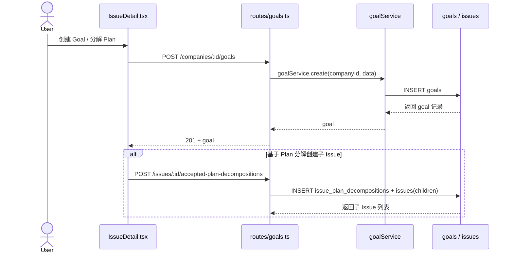
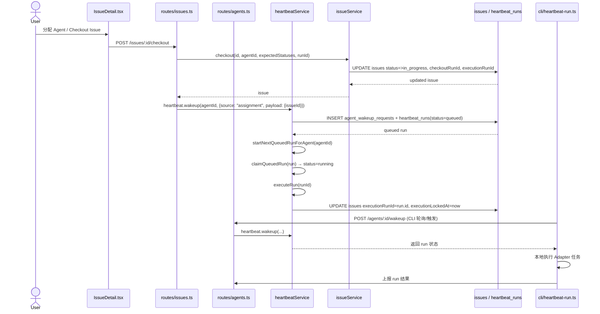
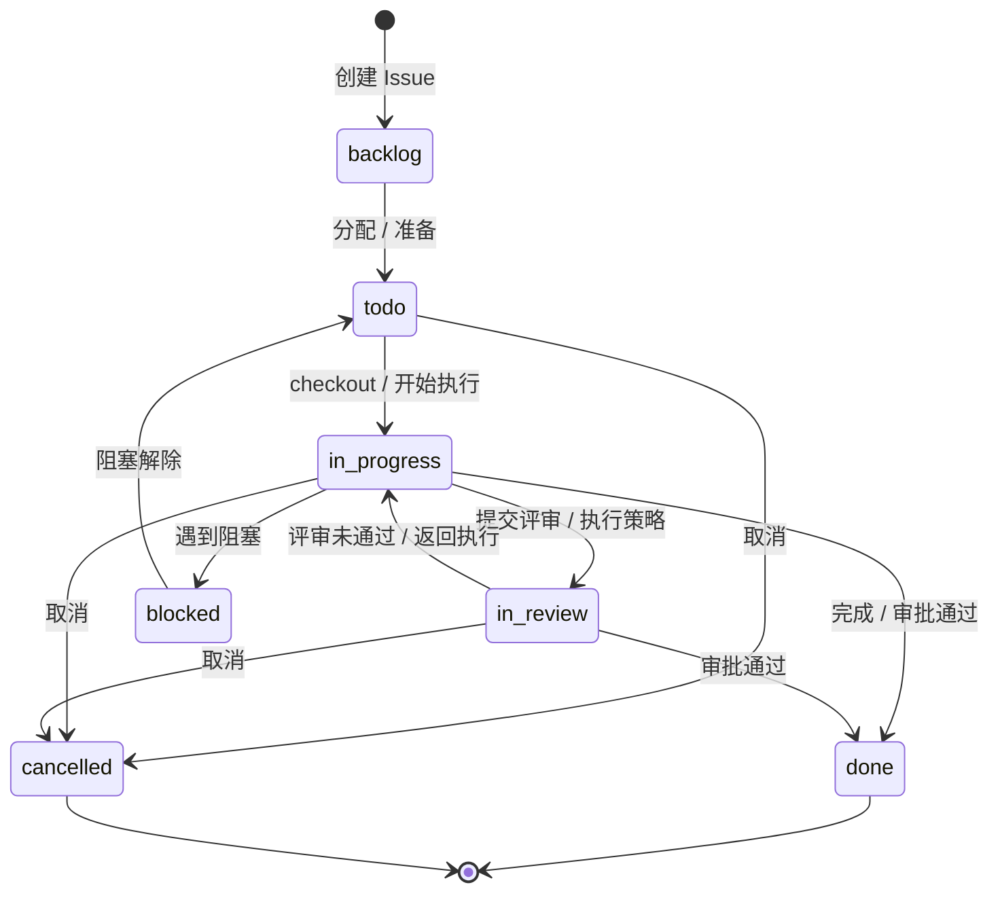
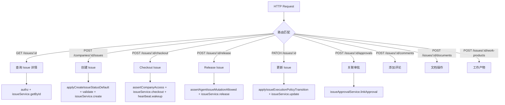
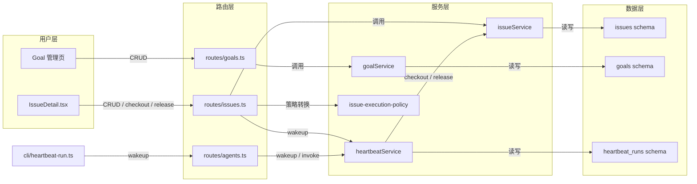

# 核心工作流：Issue 生命周期

## 端到端业务流程

### Goal 到 Issue 分解

**它是什么**：将高层业务目标（Goal）逐层拆解为可执行的 Issue 树，形成从战略到任务的工作单元层级。

**触发方式**：用户操作（Board 用户通过 UI 创建 Goal，或在 Issue 详情中基于 Plan 分解创建子 Issue）。

**流程全景**：

**关键步骤说明**：

| 步骤 | 负责模块 | 说明 |
|------|---------|------|
| Goal 创建 | `routes/goals.ts` | 接收 `createGoalSchema`，校验公司权限后创建 |
| Goal 查询 | `goalService` | 支持 list / getById / create / update / remove |
| Issue 分解 | `routes/issues.ts` | `POST /issues/:id/accepted-plan-decompositions` 将计划转化为子 Issue |
| 树形关联 | `issues` schema | `parentId` 自引用形成 Issue 树；`goalId` 关联目标 |

---

### Issue 分配与执行

**它是什么**：将 Issue 分配给 Agent（或用户），通过 Heartbeat 机制驱动 Agent 在独立工作空间中实际执行代码/任务。

**触发方式**：
- **Heartbeat 定时唤醒**：Agent 的 timer 触发 `enqueueWakeup`
- **用户分配**：用户通过 UI 修改 assignee，或 Agent checkout Issue
- **手动唤醒**：`POST /agents/:id/wakeup` 或 `POST /agents/:id/heartbeat/invoke`

**流程全景**：

**关键步骤说明**：

| 步骤 | 负责模块 | 说明 |
|------|---------|------|
| Issue Checkout | `issueService.checkout` | 将 Issue 状态设为 `in_progress`，绑定 `checkoutRunId` 与 `executionRunId`；检查依赖阻塞和 Pause Hold |
| Agent 唤醒入队 | `heartbeatService.enqueueWakeup` | 写入 `agent_wakeup_requests` 和 `heartbeat_runs(queued)`；支持幂等、合并(coalesce)、延迟(defer) |
| 运行认领 | `heartbeatService.claimQueuedRun` | 将 `queued` 转为 `running`，检查预算、依赖、树暂停等 |
| 执行运行 | `heartbeatService.executeRun` | 准备执行上下文（workspace、session、adapter config），调用 Adapter 实际运行 |
| 执行锁 | `issues` schema | `executionRunId` + `executionLockedAt` 防止并发执行；同一 Agent 可合并运行 |
| 释放 Issue | `issueService.release` | 将状态回退为 `todo`，清空 assignee 和运行绑定 |

---

### Issue 状态转换

**状态转换图**：

| 状态 | 含义 | 进入条件 | 退出条件 |
|------|------|---------|---------|
| backlog | 待办池，尚未分配 | Issue 创建默认状态 | 被分配或手动移入 todo |
| todo | 已就绪，等待执行 | 用户分配、release 后、阻塞解除 | Agent checkout 进入 in_progress |
| in_progress | 正在执行 | checkout 成功、Agent 认领运行 | 完成(done)、取消(cancelled)、进入评审(in_review) |
| in_review | 等待评审/审批 | 执行策略进入 review 阶段、用户提交 | 审批通过(done)、返回修改(in_progress)、取消 |
| blocked | 被依赖阻塞 | 依赖 Issue 未解决 | 依赖解决后回到 todo |
| done | 已完成 | 执行成功且审批通过 | 无 |
| cancelled | 已取消 | 用户或系统取消 | 无 |

---

## 模块内部执行流程

### Issue 路由处理

**它是什么**：`routes/issues.ts` 是 Issue 领域的 HTTP 入口，负责 CRUD、状态变更、文档/评论/附件/审批/工作产物等全生命周期操作，并协调 `issueService`、`heartbeatService`、`approvalService` 等下游服务。

**执行流程**：

**关键决策点**：

| 决策点 | 位置 | 逻辑 |
|--------|------|------|
| 创建时状态默认值 | `applyCreateIssueStatusDefault` | 根据请求体解析默认 status，注入 body |
| 执行策略转换 | `applyIssueExecutionPolicyTransition` | 根据 `executionPolicy` / `executionState` 计算状态、assignee、monitor 等 patch |
| Checkout 权限 | `routes/issues.ts ~5045` | 检查 project 是否 paused、Agent 只能 checkout 自己、assignee 权限 |
| Release 权限 | `routes/issues.ts ~5129` | 只有 assignee 或同 run 可 release；admin 可 force-release |
| 评论/文档/附件 | 各子路由 | 统一走 `issueService` 或独立 service，最后 `logActivity` |

---

## 流程间的关联

